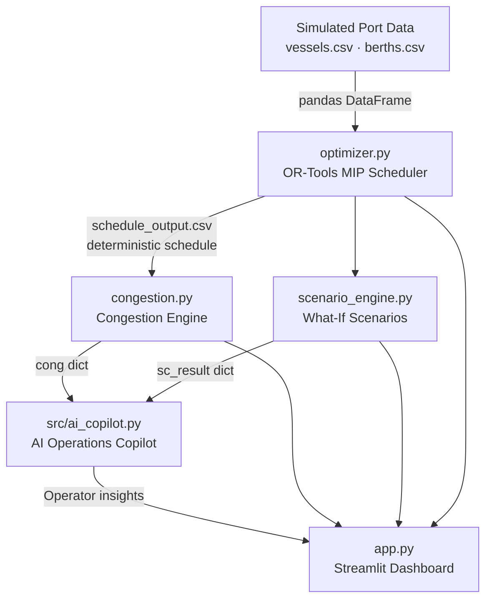

# Architecture — PortPulse AI

## System Architecture



## Components

| Component | File | Responsibility |
|---|---|---|
| MIP Optimizer | `optimizer.py` | OR-Tools SCIP berth allocation and scheduling |
| Congestion Engine | `congestion.py` | Deterministic analytical congestion scoring |
| Scenario Engine | `scenario_engine.py` | What-if scenario evaluation (re-runs optimizer) |
| **AI Operations Copilot** | `src/ai_copilot.py` | Decision-support layer — interprets engine results |
| Dashboard | `app.py` | Streamlit UI — all sections including Copilot panel |

## AI Operations Copilot

**Copilot type: Deterministic Rule-Based Decision Support**

The Copilot is NOT:
- A trained ML/AI model
- Connected to an external LLM or API
- Performing independent numerical calculation
- Requiring internet access or API credentials

The Copilot IS:
- A deterministic rule-based interpreter of structured engine outputs
- Designed so an LLM can be substituted later without changing the interface
- Grounded exclusively in values produced by the existing engines

### Copilot Architecture

```
Data (CSV files)
  ↓
optimizer.py     → schedule DataFrame
congestion.py    → cong dict (summary, berth_metrics, vessel_flags, bottleneck_berth)
scenario_engine.py → sc_result dict (baseline_metrics, scenario_metrics, deltas, bottleneck shift)
  ↓
src/ai_copilot.py
  ├── build_operational_status()   → headline + bullet facts
  ├── build_bottleneck_analysis()  → bottleneck identification + explanation
  ├── build_recommendations()      → 2–4 grounded priority actions
  ├── build_scenario_insight()     → delta interpretation + bottleneck shift warning
  └── generate_copilot_insights()  → full output dict
  ↓
app.py — AI Operations Copilot panel (Section 8b)
  ├── Operational Status   [CALCULATED FACTS badge]
  ├── Key Bottleneck       [CALCULATED FACTS badge]
  ├── Priority Actions     [AI DECISION-SUPPORT RECOMMENDATIONS badge]
  └── Scenario Insight     [CALCULATED FACTS badge + bottleneck shift warning]
```

## Data Flow

1. `data/vessels.csv` and `data/berths.csv` are loaded by the dashboard on startup.
2. `optimizer.py` runs the SCIP MIP to produce the 72-hour berth schedule.
3. `congestion.py` computes analytical congestion metrics from the schedule.
4. `scenario_engine.py` runs what-if scenarios (re-runs optimizer on modified inputs).
5. `src/ai_copilot.py` receives the structured engine outputs and generates operator insights.
6. `app.py` renders all results in the Streamlit dashboard.

## Key Design Decisions

| Decision | Rationale |
|---|---|
| Copilot reads engine outputs only | Architecture enforces that numerical truth stays in the engines |
| Deterministic rule-based copilot | No external API dependency — works without internet access |
| Separate module (src/ai_copilot.py) | Copilot logic is isolated and can be upgraded to LLM without touching engines |
| Visual distinction of facts vs recommendations | Operators must trust calculated facts; recommendations are advisory |
| Bottleneck shift detection | Warns operators of unintended consequences of interventions |

## Limitations

- Crane scheduling is not modelled (crane data exists but is unused).
- Tide windows and weather are not modelled.
- Vessel arrivals are deterministic (no stochastic delay model).
- The Copilot is deterministic rule-based, not LLM-powered.
- Simulated data only — no live port data feed.
